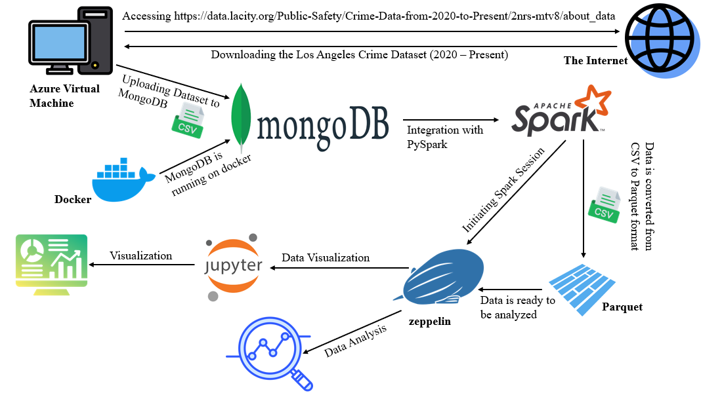

# Los Angeles Crime Data Analytics Platform

## Project Overview
A distributed big data analytics framework for processing, analyzing, and modeling crime data from the Los Angeles Police Department (LAPD). This system employs PySpark-driven ETL pipelines, spatial-temporal analysis algorithms, and machine learning models to extract actionable intelligence from crime datasets spanning 5 years (2020-2025).

## Technical Architecture

### Data Pipeline
- **Development Environment**: Jupyter Notebook for interactive analysis and model development
- **Processing Engine**: PySpark for distributed data processing and feature engineering 
- **Storage Layer**: MongoDB for document storage with Parquet files for optimized analytics
- **Data Format**: Parquet for columnar storage with compression and efficient querying

### Analysis Components
- **Data Preparation**: PySpark DataFrame operations for cleaning, transformation, and feature extraction
- **Spatiotemporal Analysis**: PySpark ML + MongoDB geospatial queries for location-based crime pattern detection
- **Time Series Analysis**: PySpark time-series functions for temporal trend identification across different crime categories
- **Statistical Modeling**: PySpark MLlib for predictive modeling and classification of crime incidents
- **Geospatial Clustering**: DBSCAN implementation in PySpark for identifying crime hotspots

### Visualization & Insights
- **Jupyter Notebooks**: Interactive analysis and visualization using matplotlib, seaborn, and folium
- **MongoDB Aggregation**: Complex data aggregations for time-based and location-based insights
- **Geospatial Mapping**: Choropleth maps and heatmaps for crime density visualization

## Implementation Details
- **PySpark Configuration**: Optimized for Parquet I/O with 8 executors, 4 cores each
- **Data Volume**: Processing approximately 1.5 million crime records across 5 years
- **Parquet Schema**: Snappy compression with partitioning by date and district
- **Performance Tuning**: Predicate pushdown and column pruning for optimized query performance
- **MongoDB Integration**: Using MongoDB as metadata store with Parquet files for raw data

## Development Workflow
- Interactive development via Jupyter Notebooks
- PySpark jobs for batch processing of historical data
- MongoDB aggregation pipelines for real-time queries and dashboards

## Data Sources
- LAPD Crime Data (2019-2024)
- LA Neighborhood Boundary Data
- Demographic statistics for correlation analysis
